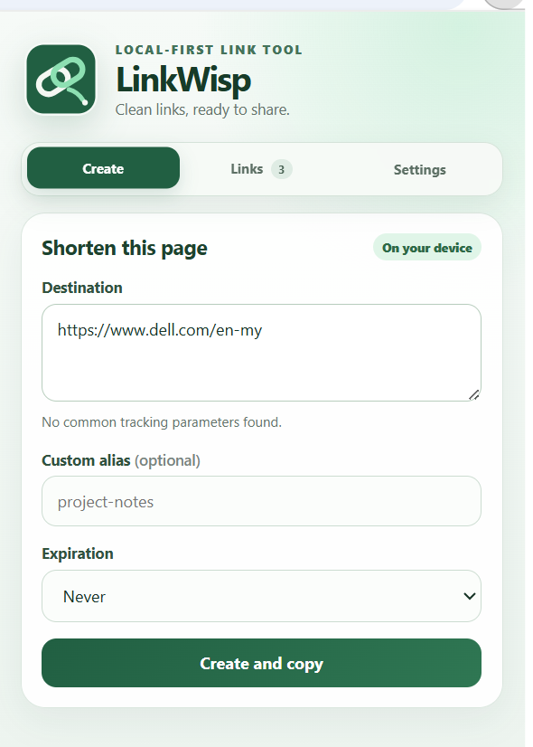

# LinkWisp

<p align="center">
  
</p>

A local-first browser extension for creating clean, shareable short links through a small service you control. Link history and preferences stay on the user's device; only the short-code-to-destination mapping is stored online so links can redirect from any browser.

<p align="center">
  
</p>

## Current status

LinkWisp v0.1.0 is a working local-first MVP for Chrome and Chromium browsers. The packaged GitHub Release has been tested against both a local Worker and a personal Cloudflare Worker + D1 production deployment. Development on `main` is preparing v0.2.0 with automated tests, a richer Edit Link dialog, and a Mozilla-linted Firefox build. The Firefox build remains a development target until it passes real-browser acceptance testing; the latest packaged release remains Chrome-only v0.1.0.

## Implemented MVP

- Shorten the current tab without copying and pasting
- Remove common tracking parameters before shortening
- Generate a random short code or request a custom alias
- Copy the result automatically
- Keep searchable history locally in the extension
- Confirm before clearing local history and management keys
- Edit a destination or expiration without changing the short URL
- Expire, disable, or delete links
- Show branded, privacy-safe pages when a link is disabled, expired, or missing
- Generate QR codes locally
- Offer a right-click action and keyboard shortcut
- Export and import local history
- Run automated extension and Worker/D1 tests on every GitHub push and release
- Build and strictly lint a Firefox-compatible target on every GitHub push

## Architecture

```text
Browser extension (local)     Cloudflare Worker + D1 (online)
-------------------------     -------------------------------
Popup and settings      ───►  Create/manage redirect mappings
URL cleaning                  Resolve /:code and redirect
Local history                 Store only required mappings
QR generation
```

The Cloudflare service is LinkWisp's own Worker code and is not Bitly, TinyURL, or another shortening provider. Cloudflare supplies the internet-accessible runtime and D1 database.

## Public code, privately controlled service

LinkWisp is designed to be reviewable as an open-source portfolio project while each hosted deployment remains controlled by its owner. A public Worker address lets anyone follow an enabled short link, but creating or managing links requires private credentials that are never included in source code or release archives.

The maintainer's personal production deployment is available at [`linkwisp.amr-m-dev.workers.dev`](https://linkwisp.amr-m-dev.workers.dev/health). Its health endpoint is public; its creation access code and D1 data are private. Developers who want a working instance should deploy the Worker and D1 database to their own Cloudflare account by following [docs/DEPLOYMENT.md](docs/DEPLOYMENT.md).

## Install the GitHub release

[LinkWisp v0.1.0](https://github.com/AMR-M-ALSHAMEERI/linkwisp/releases/tag/v0.1.0) is available from GitHub Releases with a Chrome ZIP and SHA-256 checksum. Each release ZIP includes `INSTALL.html`, which can be opened by double-clicking after extraction. See [docs/INSTALL.md](docs/INSTALL.md) for the same instructions online.

## Development setup

See [docs/DEVELOPMENT.md](docs/DEVELOPMENT.md).

To operate an independent internet-accessible instance, see [docs/DEPLOYMENT.md](docs/DEPLOYMENT.md). A custom domain is optional; a free `workers.dev` address is sufficient for personal and portfolio use.

Maintainers can build checksummed release artifacts and publish them through a version tag by following [docs/RELEASING.md](docs/RELEASING.md).

Run the complete local verification suite with:

```bash
pnpm check
pnpm test
pnpm build
pnpm lint:firefox
```

## Repository layout

```text
apps/extension/   WXT browser extension
apps/worker/      Cloudflare Worker and D1 migration
docs/             Public user and contributor documentation
```

## Brand assets

The primary **Wisp Link** mark lives at `apps/extension/public/brand/wisp-link.svg`. Chrome-ready PNG icons are provided at 16, 32, 48, 96, and 128 pixels under `apps/extension/public/icon/`.

The core palette is deep green `#215F42`, mint `#8DE0B2`, and soft cream `#F4F7F2`. The icon uses two connected rounded loops with a short flowing trail, representing a link that remains lightweight and easy to share.

## Privacy model

The extension stores history, favorites, and preferences in browser-local storage. Creating a shareable short link necessarily sends its destination and selected alias to the configured Worker. No click analytics are collected in the MVP.

Link history can be exported as a versioned JSON backup and restored on another installation. The backup excludes the main service access code, but it contains private per-link management keys and must be stored securely.

History search and favorites run entirely inside the extension. Search terms and favorite choices are not sent to the Worker; favorite state is included in local backups.

QR codes are generated locally from completed short URLs. LinkWisp does not send QR contents to an external QR service or store a second QR copy in D1.

Firefox's manifest declares `browsingActivity` and `authenticationInfo` as required transmission categories because shortening sends the selected page URL and entered access code to the user-configured Worker. This is a platform disclosure of LinkWisp's core request, not an analytics feature; local history, favorites, search terms, and QR images remain on the device.

When a public short link cannot redirect, the Worker returns a small branded status page instead of plain text. These pages do not reveal the destination, load external assets, run JavaScript, collect analytics, or permit search indexing.

First-run onboarding explains the two connection values and verifies the Worker address plus access code without creating a link. Connection settings can run the same test again whenever configuration changes.

Wrangler generates the Worker's `Env` binding type from `wrangler.jsonc`, and the workspace check rejects stale generated types. Owner and per-link credentials are compared as fixed-length SHA-256 digests through Cloudflare's timing-safe Web Crypto operation rather than ordinary string equality.

The popup is organized into Create, Links, and Settings views. Global actions report through an accessible floating notification, while contextual onboarding and QR state messages remain beside the content they explain.

The Settings view includes a compact **About LinkWisp** row. It opens a focused dialog containing the installed version, developer identity, project link, installation guide, and privacy summary. Its version is read from the installed extension manifest so it cannot drift from the packaged release.

## About

LinkWisp is developed by [AMR M. ALSHAMEERI](https://github.com/AMR-M-ALSHAMEERI). The source project is [AMR-M-ALSHAMEERI/linkwisp](https://github.com/AMR-M-ALSHAMEERI/linkwisp).

## License

LinkWisp is available under the [MIT License](LICENSE). Copyright (c) 2026 AMR M. ALSHAMEERI.
