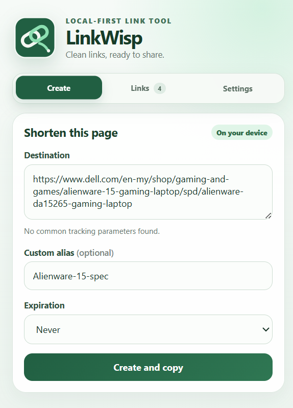
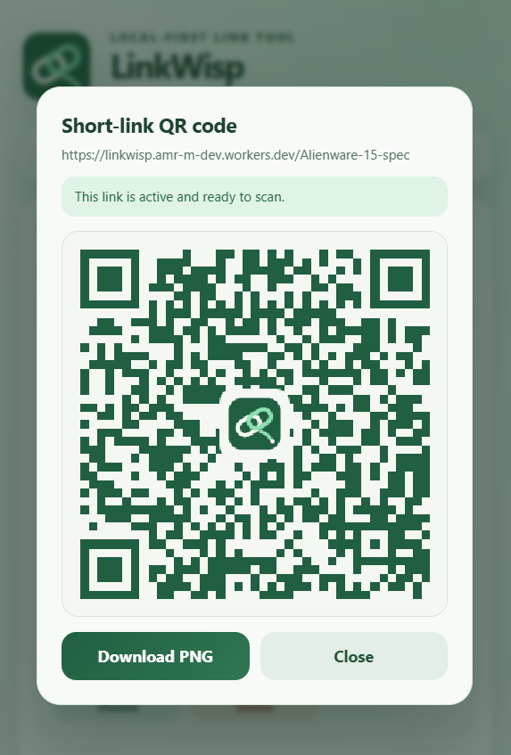
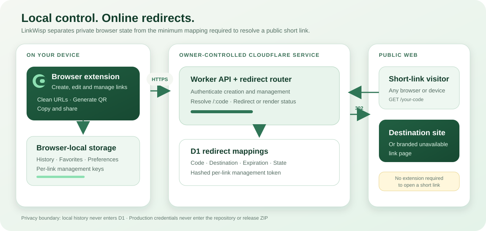

# LinkWisp

<p align="center">
  
</p>

<p align="center">
  <strong>A local-first browser extension and self-hosted URL shortener.</strong><br />
  Create clean links, manage their lifecycle, and generate QR codes while keeping history on your device.
</p>

<p align="center">
  <a href="https://github.com/AMR-M-ALSHAMEERI/linkwisp/actions/workflows/ci.yml"></a>
  <a href="https://github.com/AMR-M-ALSHAMEERI/linkwisp/releases/latest"></a>
  <a href="LICENSE"></a>
</p>

<p align="center">
  <a href="https://github.com/AMR-M-ALSHAMEERI/linkwisp/releases/latest">Download</a>
  ·
  <a href="docs/INSTALL.md">Install</a>
  ·
  <a href="docs/DEPLOYMENT.md">Self-host</a>
  ·
  <a href="CHANGELOG.md">Changelog</a>
  ·
  <a href="PRIVACY.md">Privacy</a>
</p>

<p align="center">
  
  &nbsp;&nbsp;
  
</p>

<p align="center"><sub>Create a clean link · Manage it locally · Share it as a branded QR code</sub></p>

## Why LinkWisp

Most URL shorteners make link management, history, and analytics part of a third-party account. LinkWisp takes a smaller, owner-controlled approach:

- the extension keeps history, favorites, preferences, and per-link management keys in browser-local storage;
- the online service stores only the mapping required to resolve a public short link;
- the owner deploys the included Cloudflare Worker and D1 database;
- public links redirect from any browser or device without requiring the extension;
- no click analytics, external QR service, or commercial shortening provider is used.

The repository is public for learning and portfolio review, while every deployed service remains controlled by its owner.

## What v0.2.0 delivers

- **Fast creation:** shorten the current tab, remove common tracking parameters, choose an alias and expiration, and copy the result.
- **Lifecycle management:** edit destinations and expiration, disable or re-enable links, and permanently delete mappings.
- **Local productivity:** search and favorite history, export or restore backups, and use a context-menu action or keyboard shortcut.
- **Local QR generation:** preview and download branded QR codes without sending QR contents to another service.
- **Clear failure states:** show branded, privacy-safe pages for disabled, expired, deleted, and unknown links.
- **Safer destructive actions:** use consistent confirmation dialogs for local history clearing and permanent online deletion.
- **Cross-browser engineering:** ship Chrome Manifest V3 and continuously build and strictly lint a Firefox Manifest V2 target.

## Architecture

<p align="center">
  
</p>

The extension is the private control surface. It sends authenticated creation and management requests to the owner-configured Worker, while D1 stores redirect mappings and lifecycle state. When anyone opens a short URL, the Worker resolves its code and either redirects to the destination or returns a branded unavailable-link page.

Your production access code is a Cloudflare secret—it is never committed, packaged, or shared with extension users. Another developer can deploy an independent Worker and D1 database by following the [deployment guide](docs/DEPLOYMENT.md).

## Engineering highlights

| Area | Implementation |
|---|---|
| Browser client | TypeScript, WXT, Chrome Manifest V3, Firefox Manifest V2 |
| Edge API | Cloudflare Worker with authenticated create and management routes |
| Persistence | Cloudflare D1 migrations for mappings, expiration, state, and management tokens |
| Local state | Browser storage for history, favorites, settings, and per-link management data |
| Security | Cloudflare secrets, timing-safe credential comparison, restricted status pages, no credential in releases |
| Quality | 45 automated tests, generated Worker binding checks, production builds, strict Mozilla lint |
| Delivery | GitHub Actions CI, version-gated releases, Chrome ZIP, offline installer, SHA-256 checksum |

### Request and redirect boundaries

- Creating a link sends the destination, optional alias, expiration, and configured access code to the selected Worker.
- Managing an existing link uses its private per-link management token; local search, favorites, and QR generation never contact the Worker.
- Opening a public short URL sends no extension history or owner credential. The Worker reads the mapping and returns a redirect or a privacy-safe status page.
- The maintainer’s [`/health`](https://linkwisp.amr-m-dev.workers.dev/health) endpoint is public, but the production access code and D1 contents remain private.

## Install or self-host

The [latest GitHub Release](https://github.com/AMR-M-ALSHAMEERI/linkwisp/releases/latest) provides the Chrome ZIP and its SHA-256 checksum. The archive includes an offline `INSTALL.html`; the same walkthrough is available in [docs/INSTALL.md](docs/INSTALL.md).

LinkWisp is a self-hosted tool, not a shared public shortening account. To create links, deploy the Worker and D1 database to your own Cloudflare account by following [docs/DEPLOYMENT.md](docs/DEPLOYMENT.md), then enter that Worker address and your private access code during onboarding. A custom domain is optional; a `workers.dev` address is sufficient.

The Firefox target has passed real-browser acceptance testing and strict Mozilla linting. A Mozilla-signed self-distributed package is planned; the current public release remains Chrome-only.

## Development

Requirements: Node.js, pnpm, and Git.

```bash
pnpm install --frozen-lockfile
pnpm check
pnpm test
pnpm build
pnpm lint:firefox
```

Use [docs/DEVELOPMENT.md](docs/DEVELOPMENT.md) for local extension and Worker development. Maintainers can follow [docs/RELEASING.md](docs/RELEASING.md) for version checks, packaging, checksums, and tag-triggered GitHub Releases.

```text
apps/extension/   WXT browser extension
apps/worker/      Cloudflare Worker and D1 migrations
docs/             Installation, deployment, development, and release guides
```

## Privacy

LinkWisp collects no analytics. History, favorites, search terms, preferences, and generated QR images remain on the device. The configured Worker receives only information required to create or manage a mapping. Public unavailable-link pages reveal no destination, load no external assets, run no JavaScript, and are marked against caching and indexing.

Backups intentionally exclude the main service access code, but they contain per-link management keys and should be stored securely. See the complete [privacy policy](PRIVACY.md) and deployment guide for the trust boundaries.

## Developer

Designed and developed by [AMR M. ALSHAMEERI](https://github.com/AMR-M-ALSHAMEERI).

LinkWisp is available under the [MIT License](LICENSE). Copyright (c) 2026 AMR M. ALSHAMEERI.
