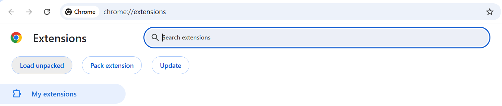
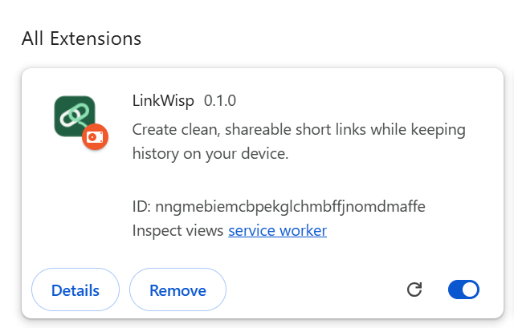
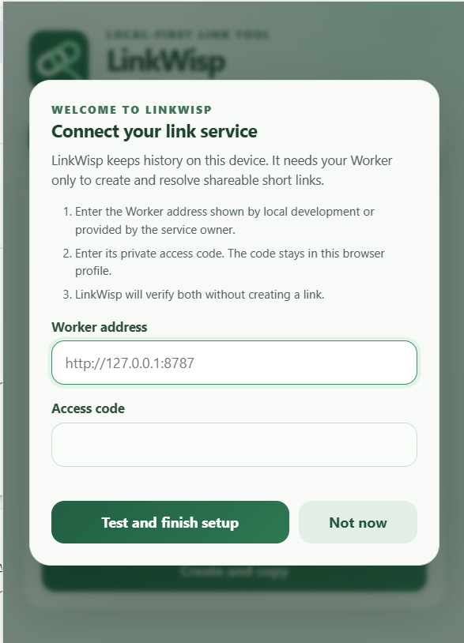

# Install from a GitHub Release

This guide is for users who do not need to read or build the source code.

> LinkWisp v0.1.0 is available from the repository's [Releases page](https://github.com/AMR-M-ALSHAMEERI/linkwisp/releases/tag/v0.1.0). Download the Chrome ZIP, not GitHub's automatically generated source archives.

After extracting the release, double-click the included `INSTALL.html` for an offline copy of the essential setup, update, and troubleshooting instructions.

## Chrome and Chromium browsers

1. Download `linkwisp-chrome-vX.Y.Z.zip` from the repository's **Releases** page.
2. Extract the ZIP into a permanent folder such as `Documents/Browser Extensions/LinkWisp`.
3. Open Chrome and enter `chrome://extensions` in the address bar.
4. Enable **Developer mode** in the upper-right corner.
5. Select **Load unpacked**.
6. Select the extracted extension folder—the folder containing `manifest.json`.
7. Pin the extension from Chrome's Extensions menu.
8. Open the extension and enter the service address and access code provided by the service owner.

After Developer mode is enabled, Chrome displays the **Load unpacked** control:

After selecting the folder containing `manifest.json`, confirm that Chrome shows LinkWisp version `0.1.0` and that its switch is enabled:

The small orange badge on the icon is Chrome's normal indicator for an unpacked development extension. It is expected for this GitHub ZIP installation method.

The installed extension should display LinkWisp's deep-green linked-loop icon in `chrome://extensions` and, when pinned, in the Chrome toolbar.

## First setup

LinkWisp opens a setup guide the first time this version runs. Enter:

- **Worker address:** the local development address or public service address provided by the LinkWisp service owner.
- **Access code:** the private creation code provided by the same owner.

Select **Test and finish setup**. LinkWisp checks the address and access code without creating a short link. Successful values are stored only in that browser profile. Select **Not now** to postpone setup; the guide returns next time.

You can reopen the guide later through **Connection settings → Run setup guide**. Use **Test and save** there to verify changed settings before replacing the saved values.

Downloading LinkWisp does not grant access to the maintainer's Cloudflare account or personal shortening service. A user needs connection values supplied by a service owner or can deploy an independent Worker and D1 database by following [DEPLOYMENT.md](DEPLOYMENT.md).

## Navigate the popup

- **Create** contains the destination, alias, expiration, and Create and copy action.
- **Links** contains search, favorites, link management, QR actions, and Show more/less for longer history.
- **Settings** contains connection verification, the setup guide, local backup tools, and an **About LinkWisp** row. Select that row to see the installed version, developer links, project links, and privacy summary in a dialog.

LinkWisp remembers the selected view during the browser session. Success and error notifications float at the top of the visible popup, so you do not need to scroll to find the result of an action.

Do not delete or move the extracted folder while the extension is installed.

## Updating

GitHub-installed Chrome extensions do not update automatically.

1. Export local history from the extension as a precaution.
2. Download and extract the newest release over the existing extension folder.
3. Open `chrome://extensions`.
4. Find **LinkWisp** and select **Reload**.

Browser-local storage normally survives a reload or code update. Export remains the safest backup.

## Back up or move local history

Open LinkWisp and use **Export** under **Local backup**. The browser downloads a dated `.json` file containing up to 200 local history records.

To restore it, select **Import**, choose the backup, review the confirmation, and approve the import. New records are added and matching records are updated. LinkWisp validates the complete file before changing local storage.

The backup does not contain the main service access code. It does contain private management keys needed to edit or delete individual links, so do not publish it, attach it to an issue, or commit it to GitHub.

## Search and favorites

Use **Search history** to find locally stored links by alias, short URL, or destination. Search happens only on the device and does not contact the LinkWisp service.

Select the star beside a link to add or remove it from favorites. Favorite links appear above other recent links and favorite state is preserved in exported backups.

## QR codes

Select **QR** on any recent link to display a scannable code for its short URL. The center Wisp Link mark is added locally with high QR error correction. Select **Download PNG** to save it as `linkwisp-ALIAS-qr.png`, or **Close** to return to history.

The QR dialog reports the link's current local state. Active links are ready to scan, while disabled and expired links open a branded explanation page until the owner changes their state. Viewing or downloading the QR remains available in every state because the encoded short URL itself does not change.

QR generation happens inside the extension. No link is sent to a QR website or additional online service.

## Unavailable links

LinkWisp explains why a short link cannot redirect without revealing its private destination. A temporarily disabled link offers **Try again**, an expired link asks the visitor to request a fresh link, and an unknown or deleted alias asks them to check the address. These pages come from the Worker, so visitors do not need the extension installed.

## Removing

Open `chrome://extensions`, find the extension, and select **Remove**. Removing the extension also removes its local browser storage. It does not automatically delete redirect mappings already created online.

## Troubleshooting

- **Chrome cannot find `manifest.json`:** You selected the outer download folder. Select the inner folder containing `manifest.json`.
- **The extension disappears after moving files:** Restore the folder to its former location or load it again from its new location.
- **Creating links fails:** Confirm the service address and access code in extension settings.
- **The Worker cannot be reached:** Confirm the address, Internet connection, and—during local development—that `pnpm dev:worker` is still running.
- **Invalid access code:** Re-enter the code supplied by the service owner. LinkWisp does not recover or display that secret.
- **A backup will not import:** Confirm that it is an unmodified LinkWisp JSON backup created by a supported version.
